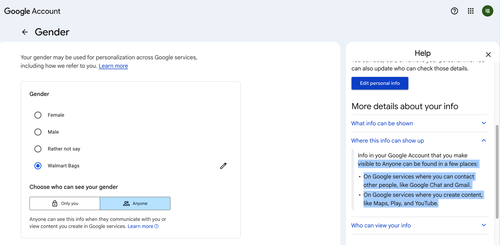
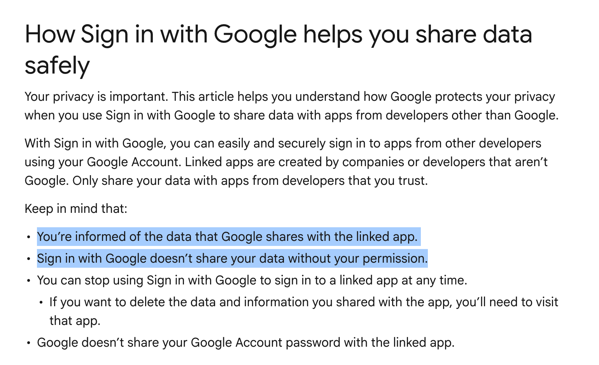

# Google OAuth — People API Birthday & Gender Leak

A proof-of-concept demonstrating how the Google People API exposes users' birthday and gender to third-party OAuth applications — even when users believe this information is private.

## The Vulnerability

When a user sets their birthday and gender visibility to **"Anyone"** (public) in their Google Account settings, they expect this information to appear only on Google's own services. [Google's own documentation](https://support.google.com/accounts/answer/6304920#zippy=%2Cwhere-this-info-can-show-up%2Cwho-can-view-your-info:~:text=Info%20in%20your,Play%2C%20and%20YouTube.) states:



> **Where this info can show up**
> Info in your Google Account that you make visible to Anyone can be found in a few places:
> - On Google services where you can contact other people, like Google Chat and Gmail.
> - On Google services where you create content, like Maps, Play, and YouTube.

This implies that "public" birthday and gender are scoped to **Google's own services only**. However, that is not the case.

Google's [Sign in with Google documentation](https://support.google.com/accounts/answer/12921417?sjid=1919169284593837430-NC) further claims:



### How It Works

1. A developer creates a standard Google OAuth 2.0 app.
2. In the Google Cloud Console, the developer enables the **People API**.
3. The app requests only the basic scopes: `openid email profile` — **no birthday or gender scopes needed**.
4. When a user whose birthday/gender is set to **"Anyone"** logs in, the app calls `people.googleapis.com/v1/people/me` and retrieves their birthday and gender — **without any additional consent prompt**.

The user sees a normal "Sign in with Google" flow. There is no indication that their birthday or gender will be accessed. The People API returns this data silently for any user who has set it to public visibility.

> **Note:** If the user has birthday/gender set to private, the People API will not return this data through the basic scopes. The app then offers a second login option that explicitly requests `user.birthday.read` and `user.gender.read` scopes — this triggers a proper consent screen where the user knowingly authorizes access.

### What's Exposed

The People API returns structured data:

```json
{
  "birthdays": [{ "date": { "year": 1990, "month": 6, "day": 11 } }],
  "genders": [{ "value": "Male" }]
}
```

## PoC

Live demo: **https://googleoauthgetbirthdaygender.vercel.app**

1. Click **"Sign in with Google"** (basic scopes only — no birthday/gender consent).
2. Authorize the app with your Google account.
3. If your birthday/gender is set to "Anyone", the app displays them immediately — you were never asked to authorize this.

Alternatively, click **"Sign in with Birthday & Gender scope"** to explicitly authorize access (this triggers a proper consent screen).

## Setup

```bash
pip install -r requirements.txt
cp .env.example .env   # Fill in GOOGLE_CLIENT_ID / GOOGLE_CLIENT_SECRET
python app.py
```

Open http://localhost:8008.

### Google Cloud Console Configuration

In [Console → APIs & Services → Credentials](https://console.cloud.google.com/apis/credentials), edit your OAuth 2.0 client.
The **Authorized redirect URIs** must match exactly:

| Environment | Redirect URI |
|-------------|-------------|
| Local dev   | `http://localhost:8008/callback` |
| Production  | `https://googleoauthgetbirthdaygender.vercel.app/callback` |

Also enable the **People API** under [APIs & Services → Library](https://console.cloud.google.com/apis/library/people.googleapis.com).

## Files

- `app.py` — All logic (login / callback / People API call / UI)
- `api/index.py` — Vercel serverless entry point
- `.env` — Credentials (ignored by .gitignore, do not commit)
